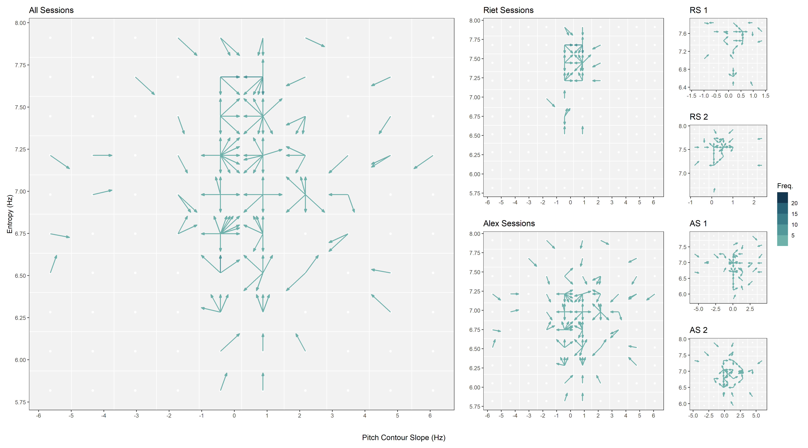
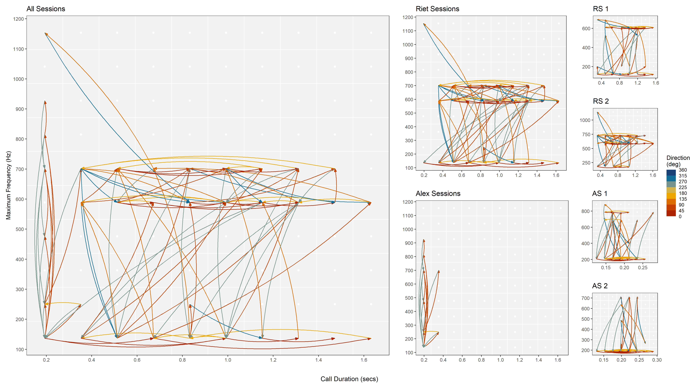
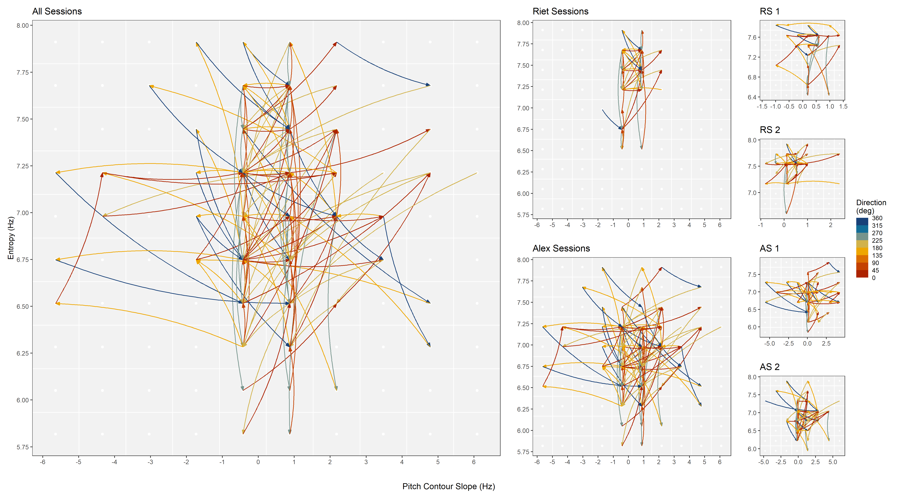
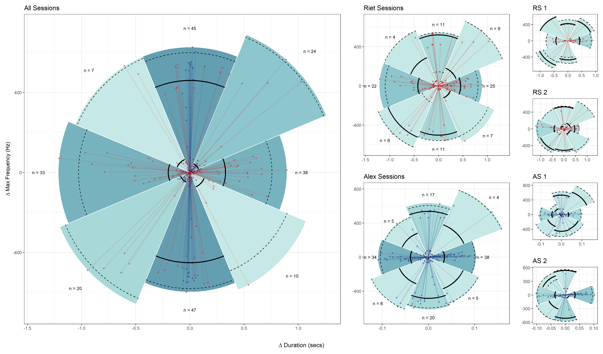
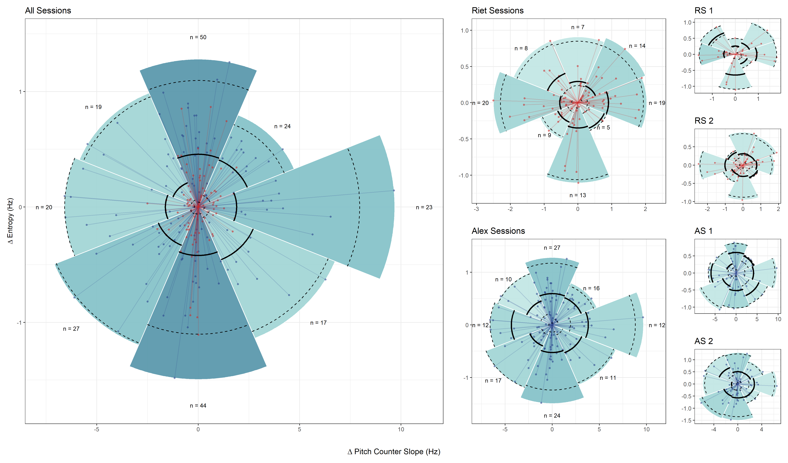
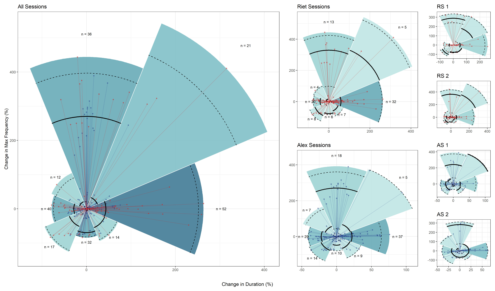
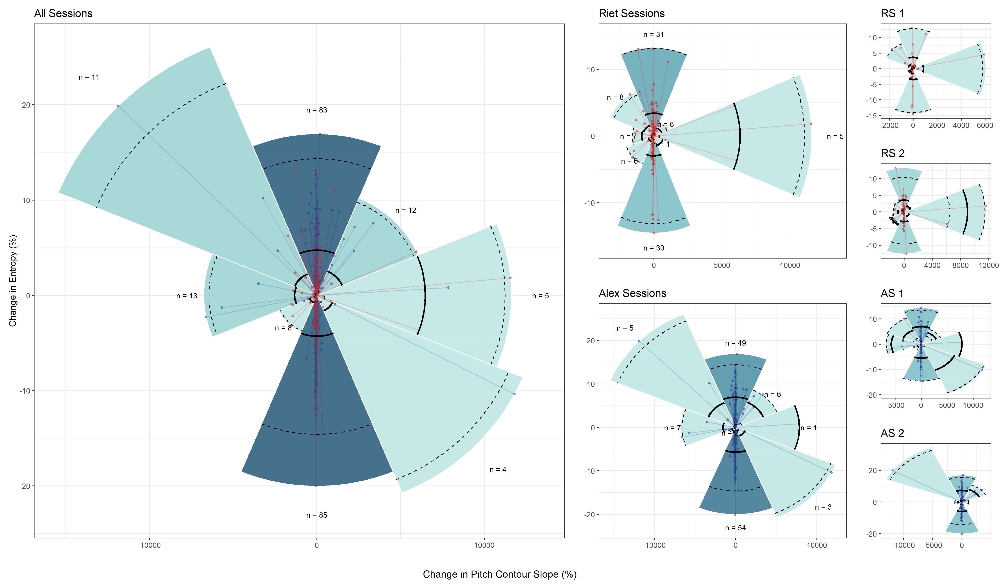

```{r}
#| include: false

#library(ggplot2)
library(readr)
#library(MetBrewer)
#library(patchwork)
#library(sf)
#library(sfheaders)
#library(colortools)
#library(rcartocolor)

dt <- readr::read_csv("data/calls_data.csv")


```

<!-- badges: start -->
<!-- badges: end -->

# Visualizations of acoustic data from chimpanzee calls

This repository contains code developed during the analysis underpinning the
manuscript *Generative vocal plasticity in chimpanzees* by Lameira *et al*
(2025, accepted under review). The code was designed to generate insightful
visualizations of acoustic data collected from audio recordings of chimpanzee
calls. Several of these visualizations appear in the final manuscript,
specifically in Figures 2-5.

To ensure reproducibility, this README outlines the setup and provides
references to the scripts used to generate these figures. Descriptions of each
visualization are included for context and ease of interpretation.


## Data

Data used for this analysis is provided in the file
[calls_data.csv](data/calls_data.csv), which includes recording details and
acoustic metrics of chimpanzee vocalizations. Each row of data corresponds to a
single call recorded from an individual during a specific session. The dataset
features both recorded and derived call attributes, such as start and end time,
frequency range, voice entropy and inflection, and changes between consecutive
calls. For more details on the extraction and processing of these metrics,
please refer to the manuscript.

## Software Requirements and Setup

The following tools are required to run the scripts:

- [R](https://www.r-project.org/) (> v4.2.1)
- [RStudio Desktop](https://posit.co/download/rstudio-desktop/)


### Setup Instructions

  1. Clone or fork the repository to your local machine
  2. Start an **RStudio** session
  3. Select *File* > *Open Project..*, navigate the folder containing the cloned 
  repository, and open the R project file *chimpanzee_calls_plots.Rproj*
  4. Run the command `renv::restore()` in the R console to install the required 
  package dependencies
  5. Open the desired script files and execute to code to reproduce the plots
  


## Plots Description and Generation

### "Snake-and-Ladder" (SNL) plots

These plots explore vocal movement within the acoustic space by graphically
depicting sequences of recorded voiced calls. Calls are binned into a 2D grid of
cells, each representing intervals of selected acoustic metrics. The plots
illustrate transitions in acoustic features between consecutive calls, offering
two variants: Spokes plots and Tracks plots.

#### SNL-Spokes: Visualizing Directional Patterns in Acoustic Space

- These plots use arrows to describe the direction of change between consecutive
calls in the acoustic space. An arrow represents a call and the direction of the
cell containing the subsequent call. For instance, to depict directional
patterns in terms of voice activation (i.e. maximum frequency vs. duration of
calls) between consecutive calls:
  
```{r}
#| message: false
#| code-fold: true

source("R/snl_plot.r")

# get aspect ratio
asp <- dt |>
  dplyr::summarise((max(duration) - min(duration))/(max(max_freq) - min(max_freq)))

dt |>
  snl_plot(
    x = duration, 
    y = max_freq, 
    time = begin_time,  
    ncx = 10, 
    ncy = 10,
    recording_id = file,
    add_freq_col = TRUE,
    type = "spokes",
    xlab = 'Call Duration (secs)', 
    ylab = "Maximum Frequency (Hz)",
    arrow_fctr = 1.8, 
    cellcent_fct = 0.8
  ) +
  ggplot2::coord_fixed(asp)

```
    
- The colour of the arrows encodes the number of transitions in the same
direction, representing traffic intensity. Darker shades indicate larger number
of occurrences.

- This variant forms the basis for **Figure 2** in the manuscript,
highlighting directional patterns in voice activation (upper panel) and voice
modulation (lower panel) at different aggregation levels. To recreate each panel
of **Figure 2**, run the script [panels_snl.r](R/panels_snl.R)

{width=60%}
{width=60%}

  
#### SNL-Tracks: Visualizing Distance Changes in Acoustic Space

- These plots illustrate actual connections between consecutive cells in the
acoustic space, depicting distance changes between successive calls under the
displayed acoustic metrics. For instance, to depict movement tracks between
consecutive calls in terms of voice activation (i.e. maximum frequency vs.
duration of calls):

```{r}
#| message: false
#| code-fold: true

dt |>
  snl_plot(
    x = duration, 
    y = max_freq, 
    time = begin_time,  
    ncx = 10, 
    ncy = 10,
    recording_id = file,
    add_freq_col = TRUE,
    type = "tracks",
    xlab = 'Call Duration (secs)', 
    ylab = "Maximum Frequency (Hz)",
    arrow_fctr = 1.8, 
    cellcent_fct = 0.8
  ) +
  ggplot2::coord_fixed(asp)
```

- Arrows are colour-coded to indicate the direction of movement (in degrees),
aiding interpretation of the transitions.

- This variant is the foundation for **Figure 3** in the manuscript,
showcasing travel patterns in voice activation (upper panel) and voice
modulation (lower panel) at different aggregation levels. To recreate each panel
of **Figure 3**, run the script [panels_snl.r](R/panels_snl.R)

{width=60%}
{width=60%}

### "Pizza" plots

These plots visually represent the degree and range of vocal changes between
consecutive calls. For a given sequence of calls, acoustic changes are grouped
into eight radial, slice-shaped polygons, radiating from an origin point
(representing no change). Key features include:

- **Slice Length**: Determined by the point at the furthest distance from the
origin within each slice.

- **Dimensional Change**: Diagonal slices indicate changes occurring predominantly
along both dimensions, while vertical and horizontal slices highlight primarily
unidimensional changes.

- **Median and Percentiles**: Solid lines mark the median distance of points from
origin within each slice, while dashed lines denote the 2.5% and 97.5%
percentiles of these distances.

- **Slice Colour Coding**: The colour saturation of each slice corresponds to the number
of points it contains, with darker shades representing higher densities.

For example, to showcase absolute differences in voice activation (i.e. maximum
frequency vs. duration of calls) featured between consecutive calls:

```{r}
#| message: false
#| code-fold: true

source("R/pizza_plot.R")
source("R/utils.r")

dt |>
  pizza_plot(
    x = delta_duration, 
    y = delta_voice_freq,
    n_slices = 8,
    offset = pi/8,
    fill_slices = TRUE,
    plot_points = TRUE,
    add_nr_points = TRUE, 
    lolli = TRUE,
    xlab = expression(Delta ~ "Duration (secs)"),
    ylab = expression(Delta ~ "Max Frequency (Hz)")
  ) + ggplot2::coord_fixed(asp)

```


This plot serves as the basis for the graphical panels presented in the manuscript:

- **Figure 4**, illustrating the absolute change in terms of voice activation 
(upper panel) and voice modulation (lower panel)

{width=60%}

{width=60%}

- **Figure 5**, depicting relative changes for the same acoustic metrics

{width=60%}
{width=60%}

To recreate **Figures 4 and 5**, run the script [panels_pizza.r](R/panels_pizza.R)

`

### Futher Details

Further insights and considerations that guided the development of these
visualizations are available [here](dev/outputs/readme.md).

