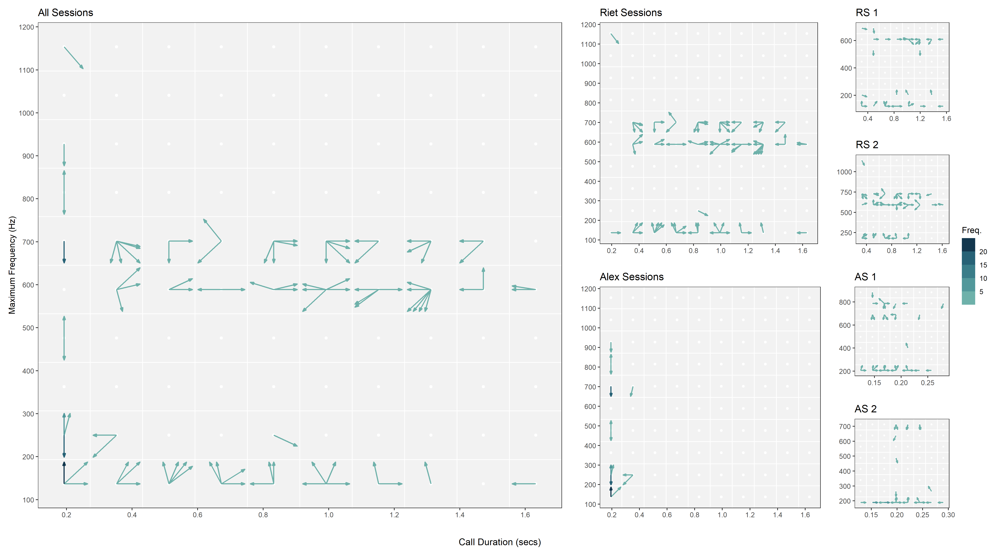

```{r}
#| include: false

#library(ggplot2)
library(readr)
#library(MetBrewer)
#library(patchwork)
#library(sf)
#library(sfheaders)
#library(colortools)
#library(rcartocolor)

dt <- readr::read_csv("data/calls_data.csv")

```

<!-- badges: start -->
<!-- badges: end -->

# Visualizations of acoustic data from chimpanzee calls

This repository contains code developed during the analysis underpinning
the manuscript *Generative vocal plasticity in chimpanzees* by Lameira *et al*
(2025, accepted under review). The code was designed to generate clear and
insightful graphical visualizations of acoustic data collected from audio
recordings of chimpanzee calls. Several of these visualizations appear in
the final manuscript, specifically in Figures 2-5.

To ensure reproducibility, this README provides a usage guide and references the
necessary scripts to generate these plots. Descriptions of each visualization
are also provided for context and clarity.


## Data

Data used for this analysis is provided in the file
[calls_data.csv](data/calls_data.csv), which includes recording details and
acoustic metrics of chimpanzee vocalizations. Each row of data corresponds to a
single call recorded from an individual during a specific session. The dataset
features both recorded and derived call attributes, such as start and end time,
frequency range, voice entropy and inflection, and changes between consecutive
calls. For more details on the extraction and processing of these metrics,
please refer to the manuscript.

## Software Requirements and Setup

The following tools are required to run the scripts:

- [R](https://www.r-project.org/) (> v4.2.1)
- [RStudio Desktop](https://posit.co/download/rstudio-desktop/)


### Setup Instructions

  1. Clone or fork the repository to your local machine
  2. Start an **RStudio** session
  3. Select *File* > *Open Project..*, navigate the folder containing the cloned 
  repository, and open the R project file *chimpanzee_calls_plots.Rproj*
  4. Run the command `renv::restore()` in the R console to install the required 
  package dependencies
  5. Open the desired script files and execute to code to reproduce the plots
  


## Plots Description and Generation

### "Snake-and-Ladder" (SNL) plots

For a sequence of recorded calls, binned into a grid of cells expressing 2D
intervals of selected acoustic metrics, these plots aim to describe vocal
movement in the acoustic space between consecutive calls. Two plot variants: Spokes and Tracks
  
#### SNL-Spokes

- Uses arrows to describe the direction of subsequent calls in the acoustic
space - i.e. an arrow represents a call and the direction of the cell containing
the subsequent call. For example, to depict the direction of movements between
consecutive calls in the acoustic space in terms of voice activation (i.e.
maximum frequency vs. duration of calls):
  
```{r}
#| message: false
#| code-fold: true

source("R/snl_plot.r")

# get aspect ratio
asp <- dt |>
  dplyr::summarise((max(duration) - min(duration))/(max(max_freq) - min(max_freq)))

dt |>
  snl_plot(
    x = duration, 
    y = max_freq, 
    time = begin_time,  
    ncx = 10, 
    ncy = 10,
    recording_id = file,
    add_freq_col = TRUE,
    type = "spokes",
    xlab = 'Call Duration (secs)', 
    ylab = "Maximum Frequency (Hz)",
    arrow_fctr = 1.8, 
    cellcent_fct = 0.8
  ) +
  ggplot2::coord_fixed(asp)

```
    
- The colour of the arrows maps the number of occurrences in the given
  direction, conveying a sense of traffic intensity (i.e. darker shades indicate
  larger number of transitions in the same direction).

- This is the base plot used to construct **Figure 2** in the manuscript,
describing directional patterns in voice activation (upper panel) and voice
modulation (lower panel) at different aggregation levels, which is generated in
script [panels_snl.r](R/panels_snl.R)



  
  

#### SNL-Tracks

- Shows the actual connections between each and subsequent cells, depicting the
distance change between consecutive calls, in terms of the contrasted metric, in
the acoustic space.

- To help visualization, arrows are coloured to represent the direction of
movement (in degrees).

- This is the base plot used to construct **Figure 3** in the manuscript.


### "Pizza" plots

These plots intend to depict the degree and range of voice change between
consecutive calls. For a given sequence of calls, points expressing acoustic
changes between consecutive calls are graphically grouped into 8 slice-shaped
radial polygons with origin at 0 (expressing no change). Furthermore:

- The length of each slice is given by the comprised point at furthest distance 
from origin.

- For a given the 2D spread of a set of points, diagonal slices illustrate cases
where changes occurred predominately on both dimensions. Vertical and horizontal
slices represent instances were changes were mostly uni-dimensional.

- Solid and dashed lines express, respectively, the median and percentiles (2.5%
and 97.5%) of the distances between the points comprised in the slice and the
origin.

- The colour of the slice maps the number of points comprised in that slice (more 
points, darker shade)


<!-- Scripts to build graphical panels for each type of plot are available in -->
<!-- files: -->

<!-- - [panels_pizza.R](panels_pizza.R)  -->
<!-- - [panels_rays.R](panels_rays.R) -->
<!-- - [panels_snl.R](panels_snl.R) -->
<!-- - [panels_snl_spokes.R](panels_snl_spokes.R) -->


### Futher Details

A more detailed description and discussion the developed plots can be found
[here](/outputs/readme.md).