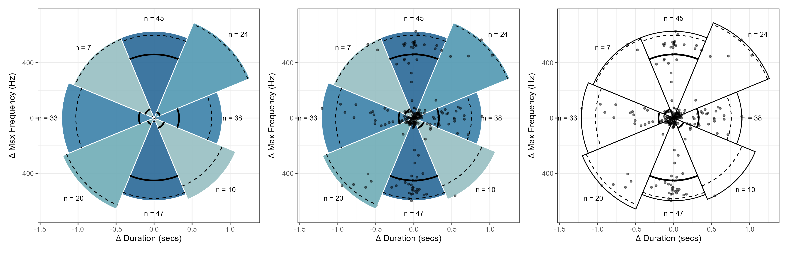
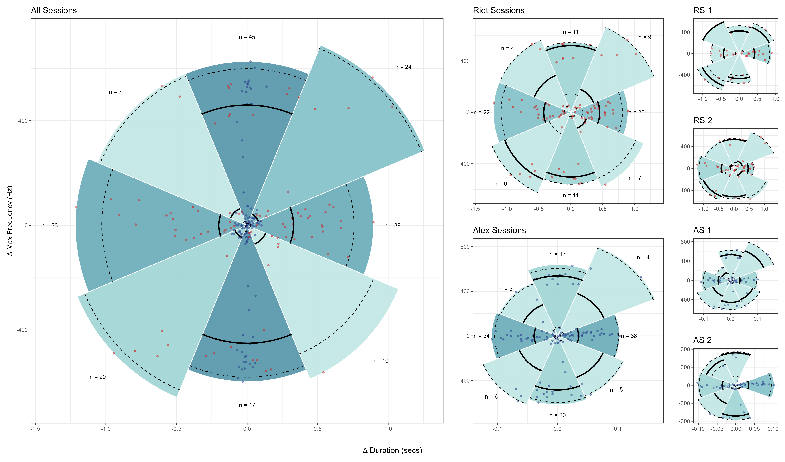
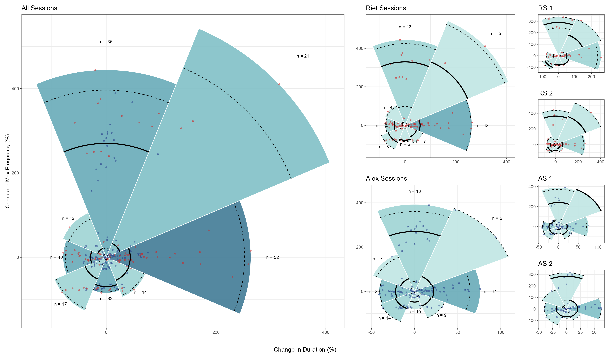

## Short description and considerations on developed plots

### Snake and Ladder" Plots

For a sequence of recorded calls, binned into a grid of cells/rectangles
expressing calls of a given Duration interval (secs) and a given interval of
values acoustic (e.g. Voice Entropy), these plots intend to describe the
movement in the acoustic space of consecutive calls.

#### Directional Spokes ("*duration_vs_xxx_snl_spokes*")

- This type of plot use arrows to describe the direction of subsequent calls in
the acoustic space - i.e. an arrow represents a call and the direction of the
cell containing the subsequent call.

- Comments:

  - There is quite a lot of overplotting due to the large number of subsequent
  calls going in the same direction (given the specified cell size). So, the
  opacity of the arrows can be interpreted as traffic intensity, with opaquer
  arrows indicating higher traffic.
  
  - As seen on the exploratory analysis, Alex's calls on both sessions were much
  shorter in duration than Riet's calls. This causes Ale's features to get
  squeezed up on the x-axis when the two subjects are plotted together or their
  individual plots are forced to use the same x-scale. So, while fixing the
  scale of x at the subject-level plots, session-level plots use varying
  x-scales (i.e scale based on inherent data) to get more detail of the
  movements occurring in each session.
  

#### Directional Tracks ("*duration_vs_xxx_snl_tracks*")

- These plots show the actual connections between each cells and subsequent cell.
To help vizualization, arrows are colored to represent the direction of movement
(in degrees), with the discrete color scale encoding the main cardinal
directions (i.e. E, NE, N, NW, W, SW, S, SE).

- Comments:

  - Not sure how readable and interpretable these plots are - on first look they
  look a lot like toddler scribblings! :)
  
  - However, they do provide more detailed information than the directional
  spoke plots.
  
  - Ideally it would be cool to have a cyclical, compass-like, colour-guide
  instead of a colourbar-guide. However, implementing it in `ggplot` as been
  more challenging than initially thought. One additional downside to the
  compass-like guide is the plotting space required for it, which would mess up
  the current spacial arrangement of the panels.
  

  
  

### "Pizza" plots

Intended to convey change in acoustic features of consecutive calls. For a given
sequence of calls, points expressing acoustic changes between consecutive calls
are graphically grouped into 8 slice-shaped radial polygons with origin at 0
(expressing no change). Furthermore:

  <!-- - The orientation of slices follow the main compass directions  -->
  
  - The length of each slice is given by the comprised point at furthest
  distance from origin.
  
  - For a given the 2D spread of a set of points, diagonal slices illustrate
  cases where changes occurred predominately on both dimensions. Vertical and
  horizontal slices represent instances were changes were mostly
  uni-dimensional.
  
  - Solid and dashed lines express, respectively, the median and percentiles
  (2.5% and 97.5%) of the distances between the points comprised in the slice
  and the origin.
  
  - The colour of the slice maps the number of points comprised in that slice
  (more points, darker shade)
  
  

#### Pizza Alternatives ("*pizza_plots_options.png*")

Several alternatives e.g. whether to display points, to use colored slices, to
add labels, where considered for the "pizza" plots. The next image shows the 3
possible combinations:

Conceptually, these are the trickier plots to describe and potentially more open
to criticism. IMO they are aesthetically very pleasing and information is
conveyed effectively but subject to potential misinterpretation if some elements
are not plotted. 

Take the plot on the left as an example. Without visualizing where the points
lie, the viewer may easily be tempted, from the left-up diagonal slice, to
interpolate that calls with delta duration of -0.75 secs and delta frequency of
200 Hz are plausible. Plotting the points (middle plot) shows that's not the
case - the length of the slice, and therefore the area of the slice is being
pushed by a couple of points on the opposite side of the slice. Sure, the label
displaying a small number of points might caution the user to be careful with strong
assumptions, but still the risk of misinterpretation is non-negligible.

That's the reason why the middle plot was chosen for the main panels. Having
points displayed makes the "n" labels somehow redundant, while colored slices
was though to be a good visual aid.

#### Absolute change ("*delta_duration_vs_delta_xxx_pizza*")

Displaying change between consecutive calls in terms of absolute differences.

Some further considerations: 

  - Due to the very different range of call duration between the two subjects,
  the color of the points encode the subject
  
  - **Important Note**: The axes scales of each plot is determined by their
  inherent data. So the slicing-up of the plotting region and associated
  grouping of points is sspecific to the spread of the plotted data.

#### Percentage change ("*pctchange_duration_vs_pctchange_xxx_pizza*")

Displaying percentage change between consecutive calls.

### "Rays" plots

These were built to address the concerns raised with the "Pizza" plots. Here
lollipop-style rays with origin at [0, 0] (i.e. no changes) are used to express
magnitude of changes. 

Slice-shaped panes with colors encoding cardinal directions are provided to
describe concomitant changes of the two variables between consecutive calls. For
example, rays sitting on the dark blue slice express positive changes occurring
predominantly on the variable mapped by the x-axis.

#### Absolute change ("*delta_duration_vs_delta_xxx_rays*")

Displaying absolute change between consecutive calls.

#### Percentage change ("*pctchange_duration_vs_pctchange_xxx_rays*")

Displaying percentage change between consecutive calls.

